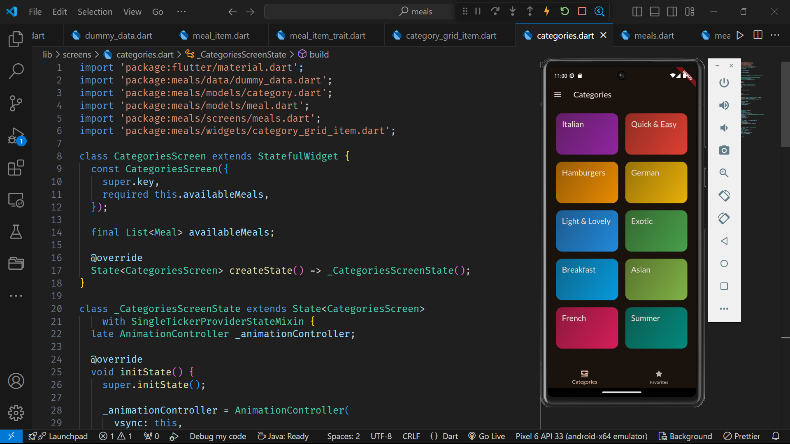
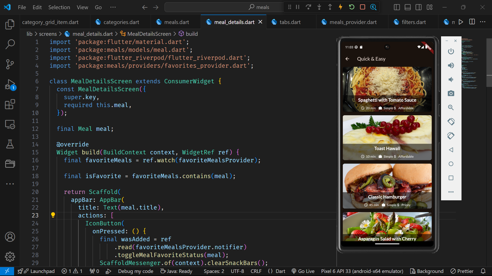
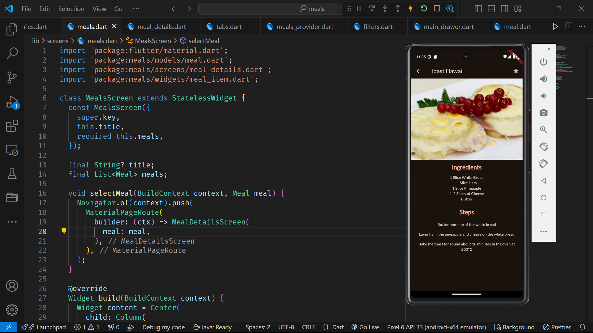
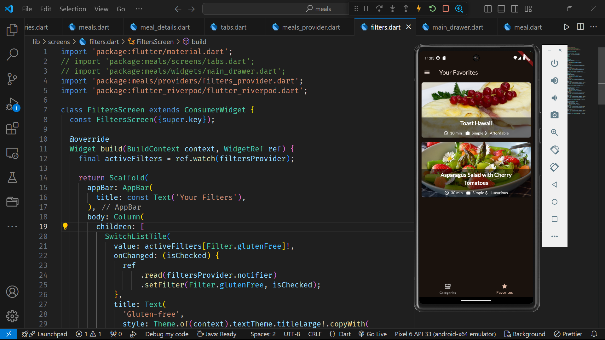

# Meals App

Welcome to the Meals App, a Flutter-based mobile application designed to help you explore and enjoy a wide variety of delicious meals.


## Features

- **Browse Meals**: Explore a wide range of meals and recipes.
- **Categories**: Filter meals by different categories.
- **Meal Details**: View detailed information about each meal, including ingredients and cooking instructions.
- **Favorites**: Mark meals as favorites for easy access.

## Screenshots






## Installation

To get a local copy up and running, follow these simple steps:

1. **Clone the repo**
   ```sh
   git clone https://github.com/your-username/meals-app.git
   ```

2. **Navigate to the project directory**
   ```sh
   cd meals-app
   ```

3. **Install dependencies**
   ```sh
   flutter pub get
   ```

4. **Run the app**
   ```sh
   flutter run
   ```

## Usage

After installing and running the app, you can explore different categories of meals, view detailed information about each meal, and mark your favorite meals for easy access.

## Contributing

Contributions are what make the open-source community such an amazing place to learn, inspire, and create. Any contributions you make are **greatly appreciated**.

1. Fork the Project
2. Create your Feature Branch (`git checkout -b feature/AmazingFeature`)
3. Commit your Changes (`git commit -m 'Add some AmazingFeature'`)
4. Push to the Branch (`git push origin feature/AmazingFeature`)
5. Open a Pull Request

## Contact

Praneet Vijay Kalyanshetti - [praneetvkhp@gmail.com](mailto:praneetvkhp@gmail.com)

Project Link: [https://github.com/Praneet2126/meals-app](https://github.com/Praneet2126/meals-app)
